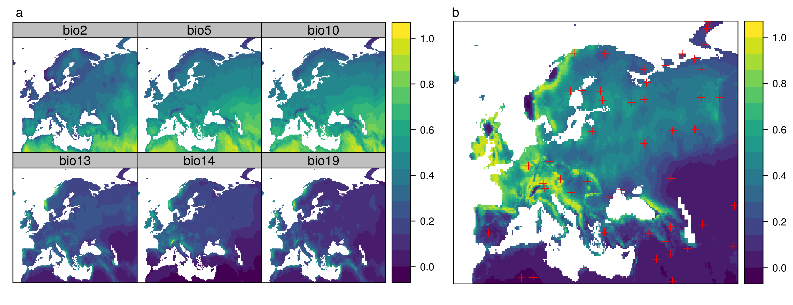
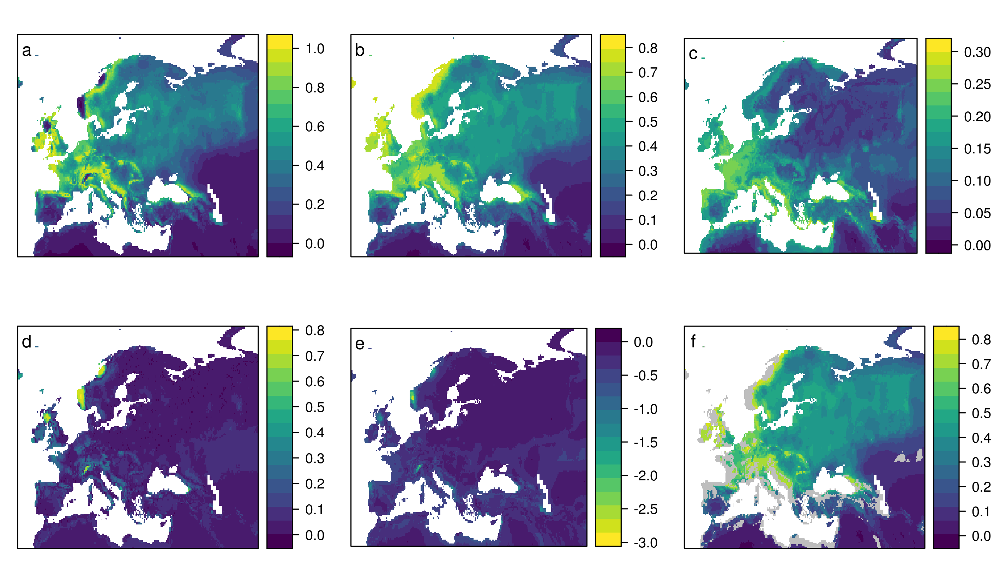
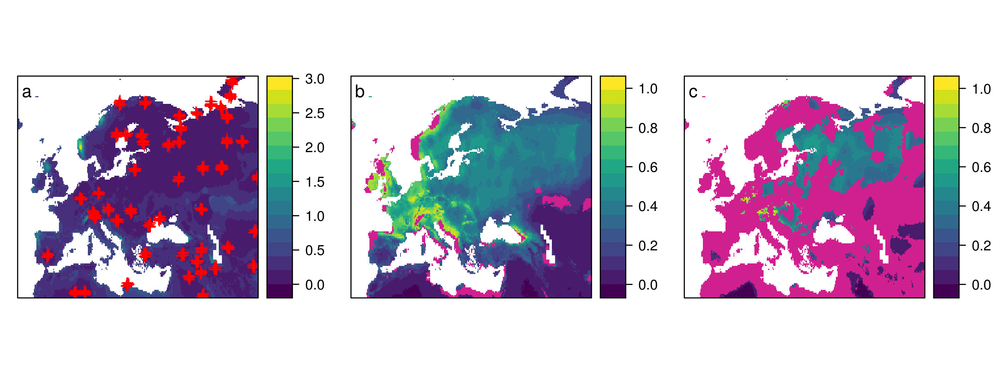
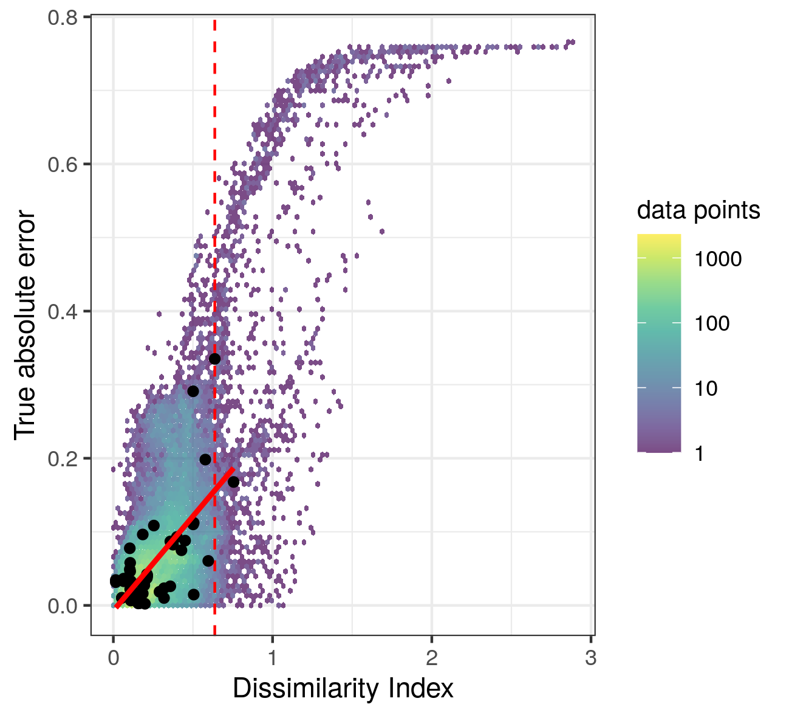

```{r setup, include=FALSE}
knitr::opts_chunk$set(echo = TRUE)
```

# Introduction
This script contains the complete code for the case study within the paper and creates the figures presented there.
It can further be used to run experiments under different settings. 
Note that running the code takes a few minutes (depending on the number of training data and the size of the study area)!

## Getting started 
Major functionality needed is the 'aoa' function from the 'CAST' package that is doing the distance based estimation of the area of applicability. 'Caret' is needed for model training. The case study uses a simulated prediction task based on the 'virtualspecies' package.

```{r libraries, message = FALSE}
rm(list=ls())
#install_github("HannaMeyer/CAST")
library(virtualspecies)
library(caret)
library(CAST)
library(viridis)
library(gridExtra)
library(knitr)
library(grid)
library(latticeExtra)

rmse <- function(pred,obs){sqrt( mean((pred - obs)^2, na.rm = TRUE) )}
```

Settings for generating the predictors and response need to be defined, as well as the number of training data points and the seed used for all functions that involve randomness.
The settings specified here are used for the case study published in the paper. Feel free to change them to see how things work under different scenarios!

### Getting started 


Note: To reproduce results used in the paper use the following settings:

* Default Case study with random data: npoints=50,design="random",meansPCA= c(3, -1), sdPCA=c(2, 2),simulateResponse=c("bio2","bio5","bio10", "bio13","bio14","bio19"),studyarea=c(-15, 65, 30, 75), seed=10

* Case Study with clustered data: npoints=500,nclusters=50,design="clustered",
maxdist <- 0.6, meansPCA= c(3, -1), sdPCA=c(2, 2), simulateResponse=c("bio2","bio5","bio10", "bio13","bio14", "bio19"), studyarea=c(-15, 65, 30, 75), seed=10


Further interesting settings:

* Case Study biased with outlier: npoints=50,design="biasedWithOutlier",countries = c("Germany","Ireland","France", "Sweden"), countriesOutlier= "Turkmenistan"
maxdist <- 0.6, meansPCA= c(3, -1), sdPCA=c(2, 2), simulateResponse=c("bio2","bio5","bio10", "bio13","bio14", "bio19"), studyarea=c(-15, 65, 30, 75), seed=10

* Case Study biased: same as biased with outlier but without the outlier


```{r settings}
npoints <- 50 # number of training samples

design <- "random"  # either clustered,biased,random, biasedWithOutlier

countries <- c("Germany","Ireland","France", "Sweden") #if design==biased
countriesOutlier <- "Turkmenistan" #if design==biasedWithOutlier A single point is set here
nclusters <- 50 #number of clusters if design==clustered
maxdist <- 0.6 #maxdist for clustered samples if design==clustered
meansPCA <- c(3, -1) # means of the gaussian response functions to the 2 axes
sdPCA <- c(2, 2) # sd's of the gaussian response functions to the 2 axes
simulateResponse <- c("bio2","bio5","bio10", "bio13",
                      "bio14","bio19") # variables used to simulate the response
studyarea <- c(-15, 65, 30, 75) # extent of study area. Default: Europe
seed <- 10
```

# Get data
Bioclim data are downloaded and cropped to the study area.

```{r data, message = FALSE}
predictors_global <- raster::getData('worldclim', var='bio', res=10, path='../data/')
wp <- extent(studyarea)
predictors <- crop(predictors_global,wp)

#create a mask for land area:
mask <- predictors[[1]]
values(mask)[!is.na(values(mask))] <- 1

```


## Generate Predictors and Response
The virtual response variable is created based on the PCA of a subset of bioclim predictors. See the virtualspecies package for further information.

```{r variables,message = FALSE}
response_vs <- generateSpFromPCA(predictors[[simulateResponse]],
                              means = meansPCA,sds = sdPCA, plot=F)

response <- response_vs$suitab.raster


```

## Simulate training points
To simulate field locations that are typically used as training data, "npoints" locations are randomly selected.
If a clustered design is used, the "npoints" are distributed over "nclusters" with a maximum distance between each point of a cluster (maxdist, in degrees).


```{r clusteredpoints,message = FALSE, include=FALSE}
#For a clustered sesign:
csample <- function(x,n,nclusters,maxdist,seed){
  set.seed(seed)
  cpoints <- sp::spsample(x, n = nclusters, type="random")
  result <- cpoints
  result$clstrID <- 1:length(cpoints)
  for (i in 1:length(cpoints)){
    ext <- rgeos::gBuffer(cpoints[i,], width = maxdist)
    newsamples <- sp::spsample(ext, n = (n-nclusters)/nclusters, 
                               type="random")
    newsamples$clstrID <- rep(i,length(newsamples))
    result <- rbind(result,newsamples)
    
  }
  result$ID <- 1:nrow(result)
  return(result)
}
```

```{r samplepoints, message = FALSE, warning=FALSE, include=FALSE}
mask <- rasterToPolygons(mask,dissolve=TRUE)
set.seed(seed)
if (design=="clustered"){
  samplepoints <- csample(mask,npoints,nclusters,maxdist=maxdist,seed=seed)
} 
if (design=="biased"){
  countryboundaries <- getData("countries", path='../data/')
  countryboundaries <- countryboundaries[countryboundaries$NAME_ENGLISH%in%c(countries),]
  samplepoints <- spsample(countryboundaries,npoints,"random")
}
if (design=="biasedWithOutlier"){
  countryboundaries <- getData("countries", path='../data/')
  countryboundariesOut <- countryboundaries[countryboundaries$NAME_ENGLISH%in%c(countriesOutlier),]
    countryboundaries <- countryboundaries[countryboundaries$NAME_ENGLISH%in%c(countries),]
  samplepoints <- spsample(countryboundaries,npoints,"random")
  samplepoints <- rbind(samplepoints,spsample(countryboundariesOut,1,"random"))
}  
  
if (design=="random"){
  samplepoints <- spsample(mask,npoints,"random")
}


```


```{r vis_data, messages = FALSE, echo = FALSE, include=FALSE}

png("../figures/trainingdata.png", width=26, height=10,units = "cm",res=300)
p1 <- spplot(stretch(predictors[[simulateResponse]],0,1),col.regions=viridis(100),
             par.settings =list(strip.background=list(col="grey")))

p2 <-spplot(response,col.regions=viridis(100),
            sp.layout=list("sp.points", samplepoints, col = "red", first = FALSE))
grid.arrange(p1,p2,ncol=2,nrow=1,widths=c(1.25,1))

grid.text("a",x = unit(0.02, "npc"), 
          y = unit(0.96, "npc"),
          just = "left")
grid.text("b",x = unit(0.57, "npc"), 
          y = unit(0.96, "npc"),
          just = "left")
invisible(dev.off())

```

```{r figs1, echo=FALSE,out.width="100%",fig.cap="Subset of the predictors as well as the response variable and the selected training data points"}

```


# Model training and prediction

## Preparation
To prepare model training, predictor variables are extracted for the location of the selected sample data locations.

```{r traindat}
trainDat <- extract(predictors,samplepoints,df=TRUE)
trainDat$response <- extract (response,samplepoints)

if (design=="clustered"){
  trainDat <- merge(trainDat,samplepoints,by.x="ID",by.y="ID")
}

trainDat <- trainDat[complete.cases(trainDat),]
```

```{r plot_trdat}

#pca_pred <- predict(response_vs$details$pca,trainDat[,response_vs$details$variables])

#axes <- response_vs$details$axes
#axes.to.plot <- axes[1:2]
# xmin <- min(response_vs$details$pca$li[, axes.to.plot[1]]) - 0.3 * diff(range(response_vs$details$pca$li[, axes.to.plot[1]]))
# xmax <- max(response_vs$details$pca$li[, axes.to.plot[1]])
# 
# pdf("../figures/plotresponse.pdf",width=6,height=6)
# plotResponse(response_vs,no.plot.reset=T)
# points(((pca_pred[,1]+10)/21.5),
#        pca_pred[,2],pch=16)
# dev.off()
```

```{r figs_plotres, echo=FALSE,out.width="100%",fig.cap="Subset of the predictors as well as the response variable and the selected training data points"}
#include_graphics("../figures/plotresponse.pdf")
```


## Training and cross-validation
Model training is then done using the caret package. Note that other packages work as well as long as variable importance can be derived. The model output gives information on the general estimated model performance based on random cross validation.

```{r training}
set.seed(seed)
if(design!="clustered"){
model <- train(trainDat[,names(predictors)],
               trainDat$response,
               method="rf",
               importance=TRUE,
               tuneGrid = expand.grid(mtry = c(2:length(names(predictors)))),
               trControl = trainControl(method="cv",savePredictions = TRUE))


print("random cross-validation performance:")
print(model)
}
#if data are clustered, clustered CV is used:
if(design=="clustered"){
  folds <- CreateSpacetimeFolds(trainDat, spacevar="clstrID",k=nclusters)
  model <- train(trainDat[,names(predictors)],
                 trainDat$response,
                     method="rf",
                 importance=TRUE,
                 tuneGrid = expand.grid(mtry = c(2:length(names(predictors)))),
                 trControl = trainControl(method="cv",index=folds$index,savePredictions = TRUE))
  print("leave-cluster-out cross-validation performance:")
  print(model)
  
  model_random <- train(trainDat[,names(predictors)],
                        trainDat$response,
                        method="rf",
                        importance=TRUE,
                        tuneGrid = expand.grid(mtry = c(2:length(names(predictors)))),
                        trControl = trainControl(method="cv",savePredictions = TRUE))
  
  print("random cross-validation performance:")
  print(model_random)
}
```


## Prediction and error calculation

The trained model is used to make predictions for the entire study area. The absolute error between prediction and reference is calculated for later comparison with the dissimilarity index.

```{r predict}
prediction <- predict(predictors,model)
truediff <- abs(prediction-response)
```

# Estimating the area of applicability

## Variable importance to get weights
The variable importance from model training can be visualized to get information on how variable weighting will be done during to estimation of the dissimilarity index

```{r varimp,message=FALSE, echo=FALSE}
cairo_pdf("../figures/varimp.pdf", width=4, height=3.5)
plot(varImp(model,scale = F),col="black")
invisible(dev.off())
```


```{r figs3, echo=FALSE, out.width="75%",fig.cap="Variable importance"}
include_graphics("../figures/varimp.pdf")
```

The area of applicability and the dissimilarity index are then calculated. First using weighted variables, and second (for comparison) without weighting. Everything is run in parallel to speed things up.

```{r uncert,message=FALSE}

#with variable weighting:
AOA <- aoa(predictors,model=model,returnTrainDI = TRUE)
#without weighting:
AOA_noWeights <- aoa(predictors,train=trainDat,variables = names(predictors))

if (design=="clustered"){
  AOA_random<- aoa(predictors, model_random)
}

preds <- model$pred[model$pred$mtry==model$bestTune$mtry,]
absError <- abs(preds$pred[order(preds$rowIndex)]-preds$obs[order(preds$rowIndex)])


predtrain <- predict(model$finalModel,trainDat,predict.all=TRUE) 
sdpred <-  apply(predtrain$individual,1,sd)
```


# Standard deviation from individual trees for comparison

For camparison to what is often used as uncertainty information, the standard deviations of the individual predictions from the 500 developed trees within the Random Forest model are calculated.

```{r RFsd, echo=FALSE}
RFsd <- function(predictors,model){
  prep <- as.data.frame(predictors)
  prep[is.na(prep)] <- -9999
  pred_all <- predict(model$finalModel,prep,predict.all=TRUE)
  sds <-  apply(pred_all$individual,1,sd)
  predsd <- predictors[[1]]
  values(predsd) <- sds
  values(predsd)[prep[,1]==-9999] <- NA
  return(predsd)
}
```


```{r calcRFsd}
predsd <- RFsd(predictors,model)

```


# Comparison

The dissimilarity index, as well as the standard deviations can then be compared to the true error. 

```{r prepare_comp}
compare <- stack(response,prediction,
                 predsd,truediff, 
                 AOA$DI)
names(compare) <- c("response","prediction", "sd","true_diff","DI")
summary(values(compare))
```

```{r plot_comp, message=FALSE, echo=FALSE}
p <- list()
txts <- c("a","b","c","d","e","f")
for (i in 1:nlayers(compare)){
  cols <-viridis(100)
  txt <- list("sp.text", c(-12,72), txts[i])
  p[[i]] <- spplot(compare[[i]],col.regions = cols, 
                   sp.layout=list(txt))
}


p[[i+1]] <- sp::spplot(prediction, col.regions=viridis(100),sp.layout=list(list("sp.text", c(-12,72), txts[i+1])))+sp::spplot(AOA$AOA,col.regions=c("violetred","transparent"))


png("../figures/caseStudy_PredRef.png",width=24, height=14,units = "cm",res=300)
grid.arrange(p[[1]],p[[2]], p[[3]],
             p[[4]],p[[5]],p[[6]],
             nrow=2,ncol=3)
invisible(dev.off())
```

```{r figs4, echo=FALSE,out.width = "100%", fig.cap="Comparison between reference (a), prediction (b), standard deviation of predictions (c), the true error (d), DI based on weighted variables (e), masked predictions (f)"}



```


## Comparison between prediction, error, DI and cross validation
```{r lm_uncert,echo=FALSE}

#DI with weights:
paste0("correlation coefficient (true error~DI)= ",
cor(values(truediff),values(AOA$DI),use="complete.obs"))
#DI no weights:
paste0("correlation coefficient (true error~DI estimated without weights)= ",
cor(values(truediff),values(AOA_noWeights$DI),use="complete.obs"))

#comparison prediction~ref
paste0("R² (prediction~reference)= ",
summary(lm(values(response)~values(prediction)))$r.squared)

paste0("r (prediction~reference)= ",
cor(values(response),values(prediction),use = "complete.obs"))

paste0("RMSE (prediction,reference)= ",
rmse(values(response),values(prediction)))

#comparison prediction for the AOA~ref
print(attributes(AOA)$aoa_stats)
predictionAOI <- prediction
values(predictionAOI)[values(AOA$AOA)==0] <- NA
paste0("R^2 AOA= ",summary(lm(values(response)~values(predictionAOI)))$r.squared)
paste0("r AOA= ",cor(values(response),values(predictionAOI),use="complete.obs"))
paste0("RMSE AOA= ",rmse(values(response),values(predictionAOI)))

# ...and for outside the AOA
predictionNOTAOI <- prediction
values(predictionNOTAOI)[values(AOA$AOA)==1] <- NA
paste0("R^2 outside AOA= ",summary(lm(values(response)~values(predictionNOTAOI)))$r.squared)
paste0("r outside AOA= ",cor(values(response),values(predictionNOTAOI),use="complete.obs"))
paste0("RMSE outside AOA= ",rmse(values(response),values(predictionNOTAOI)))

```

## Standard deviations of predictions within the AOA

The standard deviations of an ensemble are not helpful outside the AOA, however, inside the AOA they can provide helpful indicators of uncertainty, e.g. due to low data point densities.

```{r lm_SDwithinAOA, include=FALSE}
png("../figures/caseStudy_sdWithinAoa.png",width=10, height=10,units = "cm",res=300)
spplot(compare$sd,col.regions=viridis(100))+spplot(AOA$AOA,col.regions=c("violetred","transparent"))
invisible(dev.off())
```


```{r figs_sd, echo=FALSE,out.width="100%",fig.cap="Standard deviations of the random forest ensemble within the AOA"}
include_graphics("../figures/caseStudy_sdWithinAoa.png")
```


## If applicable: Comparison random vs spatial CV and AOA estimation

```{r lm_uncert_sp, echo=FALSE}
if(design!="clustered"){
 print("not applicable here because no clustered design was chosen") 
}
if(design=="clustered"){
  prediction_random <- predict(predictors,model_random)
  
predictionAOI <- prediction_random
values(predictionAOI)[values(AOA_random$AOA)==0] <- NA
print(paste0("R^2 AOA= ",summary(lm(values(response)~values(predictionAOI)))$r.squared))
print(paste0("r AOA= ",cor(values(response),values(predictionAOI),use="complete.obs")))

print(paste0("RMSE AOA= ", rmse(values(response),values(predictionAOI))))

predictionNOTAOI <- prediction_random
values(predictionNOTAOI)[values(AOA_random$AOA)==1] <- NA
print(paste0("R^2 outside AOA= ",summary(lm(values(response)~values(predictionNOTAOI)))$r.squared))
print(paste0("r outside AOA= ",cor(values(response),values(predictionNOTAOI),use="complete.obs")))
print(paste0("RMSE outside AOA= ",rmse(values(response),values(predictionNOTAOI))))
}
```

```{r compare_spatial,echo=FALSE}
if (design=="clustered"){
p <- list()
p[[1]] <-  spplot(AOA$DI,col.regions = cols,
            sp.layout=list(list("sp.points", samplepoints, col = "red", first = FALSE),list("sp.text", c(-12,72), "a")))
p[[2]] <- sp::spplot(prediction, col.regions=viridis(100),sp.layout=list(list("sp.text", c(-12,72), "b")))+sp::spplot(AOA$AOA,col.regions=c("violetred","transparent"))

p[[3]] <- sp::spplot(prediction_random, col.regions=viridis(100),sp.layout=list(list("sp.text", c(-12,72), "c")))+sp::spplot(AOA_random$AOA,col.regions=c("violetred","transparent"))

png("../figures/caseStudy_SPvsRandom.png",width=24, height=9,units = "cm",res=300)

grid.arrange(p[[1]],p[[2]], p[[3]],
             nrow=1,ncol=3)
invisible(dev.off())
}
```

```{r figs6, echo=FALSE, out.width="100%",fig.cap="Comparison between spatial vs non spatial estimation of the AOA"}
if(design=="clustered"){
  
}
```

## DI as a quantitative uncertainty measure?

### Relationship between the DI and the absolute error on a data-point-level

Plotting the RMSE of cross-validated prodictions as well as the corresponding DI gives an impression about the error~DI relationship.
This can also be visualized via hexbins for the true error~DI relationship.


```{r hexbin, warning=FALSE, message=FALSE, echo=FALSE}
dat_all <- data.frame("true_abs_error"=values(truediff),                    "type"=rep("DI",length(values(AOA$DI))), 
                      "value"=values(AOA$DI))
th <- attributes(AOA)$aoa_stats$threshold

dat2 <- data.frame("DI"=attributes(AOA)$TrainDI,
                   "error"=absError)


png("../figures/hexbin.png", width=11, height=10,units="cm",res=300)
ggplot(dat_all, aes(value,true_abs_error)) +
  stat_binhex(bins=100)+
  ylab("True absolute error")+
  xlab("Dissimilarity Index")+
  geom_vline(xintercept=th,linetype="dashed",col="red")+
  scale_fill_gradientn(name = "data points",
                       trans = "log",
                       breaks = 10^(0:3),
                       colors=viridis(10, alpha=.7))+
  theme_bw()+
 theme(legend.title = element_text( size = 10))+
  geom_point(data=dat2,aes(DI,error))+
  stat_smooth(data=dat2,aes(DI,error),method="lm",se = FALSE,col="red")

invisible(dev.off())
```


```{r figs5, echo=FALSE, out.width="50%",fig.cap="Relationship between the DI and the true error for the cross-validated training data (black points) as well as for the entire spatial reference dataset (hexbins)"}

```


### Relationship between the DI and the requested performance measure (here RMSE) 

The relationship between error and DI can be used to limit predictioons to an area (within the AOA) where a required performance (e.g. RMSE, R2, Kappa, Accuracy) applies.
This can be done using the result of calibrate_aoa which used the relationship analyzed in a window of DI values. The corresponding model (here: shape constrained additive models) can be used to estimate the performance on a pixel level, which then allows limiting predictions using a threshold.

```{r userAOA_cv, warning=FALSE, message=FALSE, echo=FALSE,include=FALSE}


AOA_new <- calibrate_aoa(AOA,model,window.size = 5,showPlot=FALSE)

recl <- attributes(AOA_new)$calib$group_stats

reference_perf <- as.data.frame(stack(AOA$DI,response,prediction))
reference_perf <- reference_perf[order(reference_perf$DI),]
names(reference_perf) <- c("DI","obs","pred")


### do this for ul,ll of training data
slidingw <- attributes(AOA_new)$calib$group_stats
reference_metric <- apply(slidingw,1,function(x){
  x_df <- data.frame(t(x))
  subs_ref <- reference_perf[reference_perf$DI>x_df$ll&
                   reference_perf$DI<x_df$ul,]
  rmse(subs_ref[,"pred"],subs_ref[,"obs"])
})
  

cairo_pdf("../figures/AOA_calibrate_singleCV.pdf", width=6, height=5)
plot(recl$DI,recl$RMSE,xlab="DI",ylab=model$metric)
points(recl$DI,reference_metric,col="red")
legend("topleft",lty=c(NA,NA,2),lwd=c(NA,NA,1),pch=c(1,1,NA),col=c("black","red","black"),
       legend=c("CV","Truth","model"),bty="n")
  lines(seq(0,max(reference_perf$DI,na.rm=T),0.01),predict(attributes(AOA_new)$calib$model,data.frame("DI"=seq(0,max(reference_perf$DI,na.rm=T),0.01))),lwd=1,lty=2,col="black")
  
invisible(dev.off())


png("../figures/errormap_group_singleCV.png",width=24, height=9,units = "cm",res=300)
#grid.arrange(p[[1]],p[[2]], p[[3]],ncol=3)
stck <- stack(AOA_new$expectedError,mask(truediff,AOA_new$expectedError),
             mask(compare$sd,AOA_new$expectedError))
names(stck) <- c("expected_error","true_error","sd_of_predictions")
spplot(stck,col.regions=viridis(100))+
    sp::spplot(AOA_new$AOA,col.regions=c("violetred","transparent"))
invisible(dev.off())
```

```{r figs7, echo=FALSE, out.width="100%",fig.cap="Relationship between the cross-validated DI and the RMSE using the cross-validation folds already used during model training. The RMSE was estimated using predictions and observed values within a window of DI values."}
include_graphics("../figures/AOA_calibrate_singleCV.pdf")
```


#### Using muliple CV's

The calibration shown above uses the cross-validion folds used during model training only. However, to be able to test the ability of the model to do both, interpolation and extrapolation, we suggest to test multiple cross-validations. Here, we split the data into folds by clusterin in the predictor space. We use all cross-validated predictions and DI values to then estimate the error~Di relationship.
Since cross-validation is done with respect to extrapolation as well, the estimated AOA is in most cases larger compared to the application of a CV which is not explicitely testing for extrapolation.

We compare the relationship estimated by cross-validation with the true relationship from the reference.


```{r userAOA_multicv, warning=FALSE, message=FALSE, echo=FALSE,include=FALSE}

AOA_new <- calibrate_aoa(AOA,model,multiCV=TRUE,length.out = 10,window.size = 10,showPlot=FALSE)


recl <- attributes(AOA_new)$calib$group_stats

reference_perf <- as.data.frame(stack(AOA$DI,response,prediction))
reference_perf <- reference_perf[order(reference_perf$DI),]
names(reference_perf) <- c("DI","obs","pred")

slidingw <- attributes(AOA_new)$calib$group_stats
reference_metric <- apply(slidingw,1,function(x){
  x_df <- data.frame(t(x))
  subs_ref <- reference_perf[reference_perf$DI>x_df$ll&
                   reference_perf$DI<x_df$ul,]
  rmse(subs_ref[,"pred"],subs_ref[,"obs"])
})
  
 
#saveRDS(recl,"test.RDS")


cairo_pdf("../figures/AOA_calibrate.pdf", width=6, height=5)
plot(recl$DI,recl$RMSE,xlab="DI",ylab=model$metric)
points(recl$DI,reference_metric,col="red")
legend("topleft",lty=c(NA,NA,2),lwd=c(NA,NA,1),pch=c(1,1,NA),col=c("black","red","black"),
       legend=c("CV","Truth","model"),bty="n")
lines(seq(0,max(reference_perf$DI,na.rm=T),0.01),predict(attributes(AOA_new)$calib$model,data.frame("DI"=seq(0,max(reference_perf$DI,na.rm=T),0.01))),col="black",lty=2)
invisible(dev.off())


png("../figures/errormap_group.png",width=24, height=9,units = "cm",res=300)
stck <- stack(AOA_new$expectedError,mask(truediff,AOA_new$expectedError),
             mask(compare$sd,AOA_new$expectedError))
names(stck) <- c("expected_error","true_error","sd_of_predictions")
spplot(stck,col.regions=viridis(100))+
    sp::spplot(AOA_new$AOA,col.regions=c("violetred","transparent"))
invisible(dev.off())
```


```{r figs8, echo=FALSE, out.width="100%",fig.cap="Relationship between the cross-validated DI and the RMSE using multiple cross-validation folds (clusters in predictor space from few to many clusters). The RMSE was estimated using predictions and observed values within a window of DI values."}
include_graphics("../figures/AOA_calibrate.pdf")
```


```{r figs9, echo=FALSE, out.width="100%",fig.cap="Expected performance which can be used to limit predictions to areas where a required performance applies. For comparison, the true prediction error as well as the standard deviations of the Random forest ensemble are shown."}
include_graphics("../figures/errormap_group.png")
```


